<p align="center">
  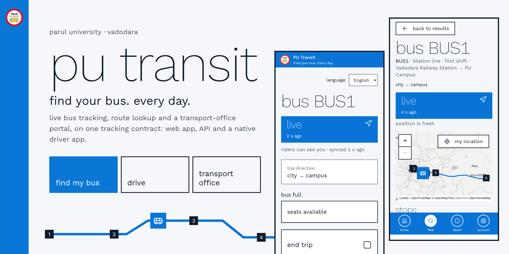
</p>

<h1 align="center">PU Transit</h1>

<p align="center">
  <b>Find your bus. Every day.</b><br>
  Bus-route lookup, live bus tracking and a transport-office portal for Parul University, Vadodara.
</p>

<p align="center">
  
  
  
  
  
  <br>
  
  
  
  
  
</p>

<p align="center">
  <a href="#screenshot-tour"><b>Screenshot tour</b></a> ·
  <a href="#getting-started"><b>Run the demo</b></a> ·
  <a href="#system-architecture"><b>Architecture</b></a> ·
  <a href="#how-live-tracking-works"><b>Live tracking</b></a> ·
  <a href="#api-overview"><b>API</b></a> ·
  <a href="#documentation-index"><b>Docs</b></a>
</p>

---

PU Transit is a monorepo with three products that share one contract:

| Product | Who uses it | Where it lives |
|---|---|---|
| **Web app** (student / staff, driver console, admin portal) | Everyone | [`artifacts/pu-transit`](artifacts/pu-transit) |
| **API server** (auth gate, tracking contract, route publishing, geo proxy) | Both clients | [`artifacts/api-server`](artifacts/api-server) |
| **Native driver app** (background GPS tracking on Android / iOS) | Drivers | [`artifacts/pu-transit-driver`](artifacts/pu-transit-driver) |

Data lives in **Firebase Authentication** and the **Firebase Realtime Database (RTDB)**. The database Rules are the final authority on who may read or write what; the API and the UI re-check the same policy but cannot bypass it.

### Highlights

| | |
|---|---|
| **Live means live** | The bus marker is shown only for a running trip with a usable position. Riders see *live*, *delayed*, *weak GPS*, *GPS unavailable* or *offline*, worked out from **server** timestamps, so a phone with a wrong clock cannot fake a live bus. A delayed bus keeps its last known position; an offline, GPS-unavailable or ended bus leaves the map. |
| **Real roads, real stops** | Road paths are plotted by OpenRouteService through the exact stop list the office entered, on a map locked to Vadodara. A hand-drawn path can be published only when the office ticks *manual path*, and riders then see "path not verified". |
| **One tracking engine, two driver apps** | The web driver console and the native Android / iOS app share the same DOM-free state machine, including sequence numbers, a single publisher per bus, and an End that is retried if it fails offline. |
| **The office stays in control** | Force-end and handover, dated bus assignments, service notices and no-service days. Office changes are written to an append-only audit log, and the API reports an error if that audit write fails. |
| **Built for drivers** | A preflight checklist before Start, large tiles, an honest GPS and sync readout, and a console in **English, हिन्दी and ગુજરાતી**. |
| **Private by default** | A rider's own location is opt-in, shown only on their phone and never uploaded. |

---

## Contents

1. [What it does](#what-it-does)
2. [Screenshot tour](#screenshot-tour)
3. [System architecture](#system-architecture)
4. [How live tracking works](#how-live-tracking-works)
5. [Route publishing lifecycle](#route-publishing-lifecycle)
6. [Data model](#data-model)
7. [Security and access model](#security-and-access-model)
8. [API overview](#api-overview)
9. [Repository structure](#repository-structure)
10. [Tech stack](#tech-stack)
11. [Getting started](#getting-started)
12. [Configuration](#configuration)
13. [Testing](#testing)
14. [Native driver app](#native-driver-app)
15. [Deployment](#deployment)
16. [Documentation index](#documentation-index)
17. [Project status](#project-status)
18. [Acknowledgements](#acknowledgements)

---

## What it does

| Role | What they can do |
|---|---|
| **Student / staff** | Pick a shift (First / ADM-Medical / General), enter a bus number and see the published route (origin, destination, ordered stops and the road path) on a map locked to Vadodara. The bus marker appears **only while the tracking contract is satisfied**, with the age of the last update and an explicit state (not started, acquiring, live, delayed, weak GPS, GPS unavailable, offline, ended). Notices from the transport office and the service calendar are shown on the same page. Personal location on the map is opt-in and never leaves the phone. |
| **Driver** | Signs in with a driver account, sees the buses they may drive today (a dated assignment for today is offered first; the standing bus stays available), runs a **preflight** (account, assignment, bus in service, network and location permission; the native app also checks battery optimisation, the web console shows a battery and screen-on reminder) and taps **Start** / **End**. The screen reports GPS quality, connection state and the last successful sync truthfully: *acquiring* before *live*, *pending end* when offline, *conflict* when another device owns the trip. The web console can be switched between English, Hindi and Gujarati. |
| **Admin (transport office)** | **Fleet**: bus registry, live feeds, force-end and handover. **Routes**: stops-first route builder with Vadodara-boxed place search, coordinate / Google Maps link paste and map taps; drafts, publish, versions, archive. **Users**: role confirmation, standing bus per driver, membership expiry. **Assignments**: dated bus assignments for one day and shift, added on top of the standing bus. **Notices** and **Calendar**: service notices (≤ 280 characters, ≤ 30 days) and no-service days. **System**: append-only audit log and legacy import. |

> [!IMPORTANT]
> What it deliberately does **not** claim: no ETA, no historical trails, no "Live" just because Start was pressed, and no student location stored on the server.

---

## Screenshot tour

One ordinary morning on PU Transit, from the transport office to the rider's phone.

> [!NOTE]
> All screenshots come from the isolated local demo (`pnpm demo`, see [Getting started](#getting-started)), captured in a headless browser. Every account, bus, route, notice and trip is synthetic: the extra buses, routes and notices were added through the same API the admin portal uses, the road paths were computed from OpenStreetMap road data outside the app and saved as plotted paths (the demo has no OpenRouteService key), and the trips were simulated through the tracking API. The Firebase emulator banner is hidden in the images. No production data appears anywhere.

### 1 · The office publishes a route

<p align="center">
  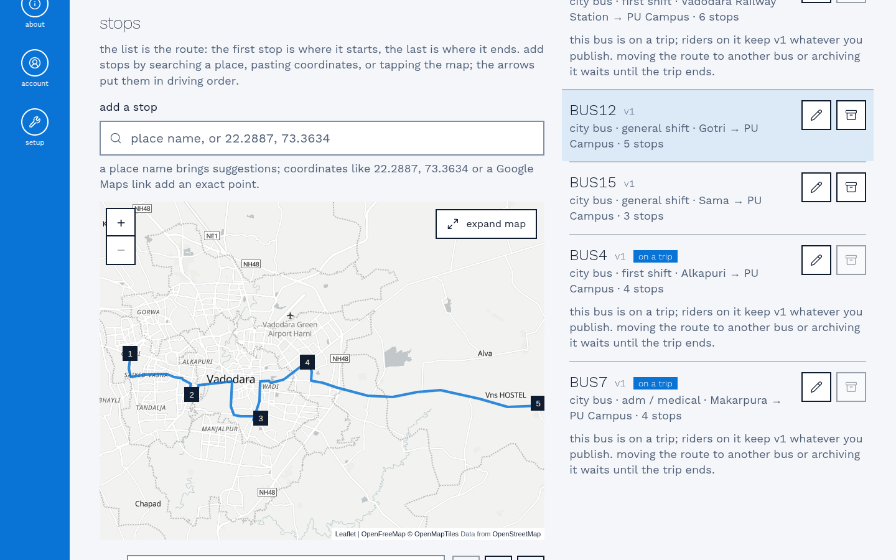
</p>

**Admin → Routes.** The builder starts from stops: search a place, paste coordinates or a Google Maps link, or tap the map. The road path is plotted through every stop in order, and publishing creates a new version. Riders on a running trip keep the version they started with, and the saved-routes list shows which buses are on a trip right now.

### 2 · The driver checks in and goes live

<table>
  <tr>
    <td width="33%" align="center" valign="top">
      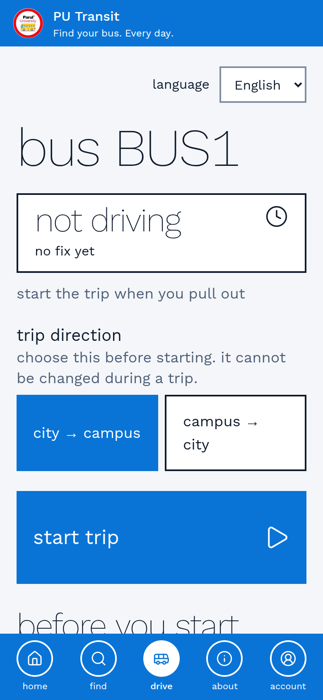
      <br><sub><b>Ready.</b> The console offers today's bus: a dated assignment first, then the standing bus. The direction is chosen before Start and cannot change during the trip.</sub>
    </td>
    <td width="33%" align="center" valign="top">
      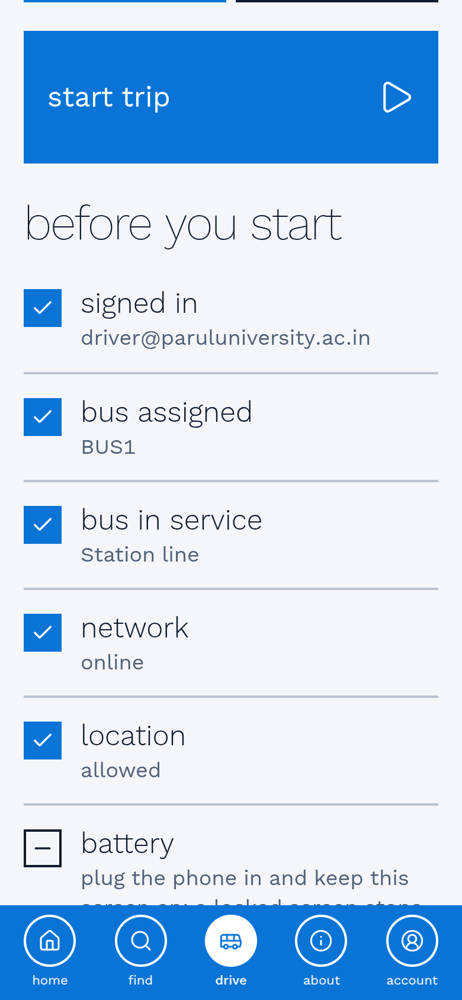
      <br><sub><b>Preflight.</b> Account, assigned bus, bus in service, network and location permission are checked before Start, plus a battery reminder.</sub>
    </td>
    <td width="33%" align="center" valign="top">
      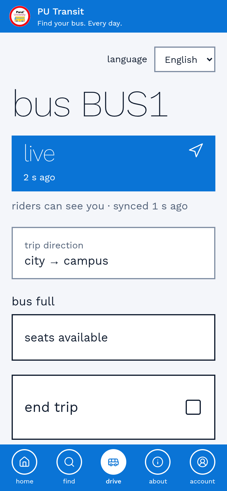
      <br><sub><b>Live.</b> "Riders can see you" appears only after an accurate fix has been uploaded, next to the time of the last successful sync.</sub>
    </td>
  </tr>
</table>

### 3 · Riders find the bus and watch it move

<p align="center">
  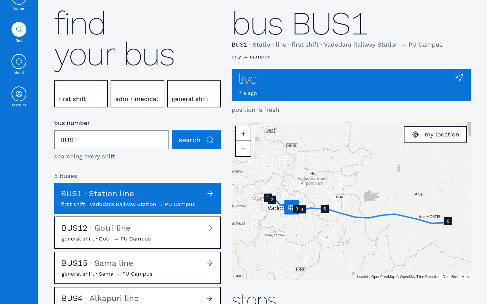
</p>

<table>
  <tr>
    <td width="50%" align="center" valign="top">
      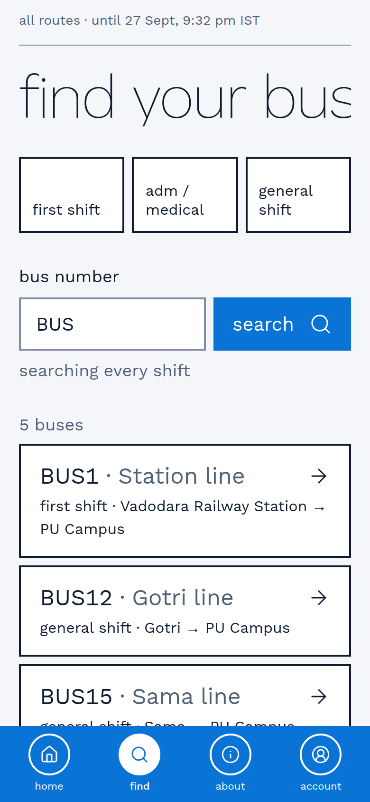
      <br><sub><b>Find.</b> Shift tiles and a bus-number search across every published route.</sub>
    </td>
    <td width="50%" align="center" valign="top">
      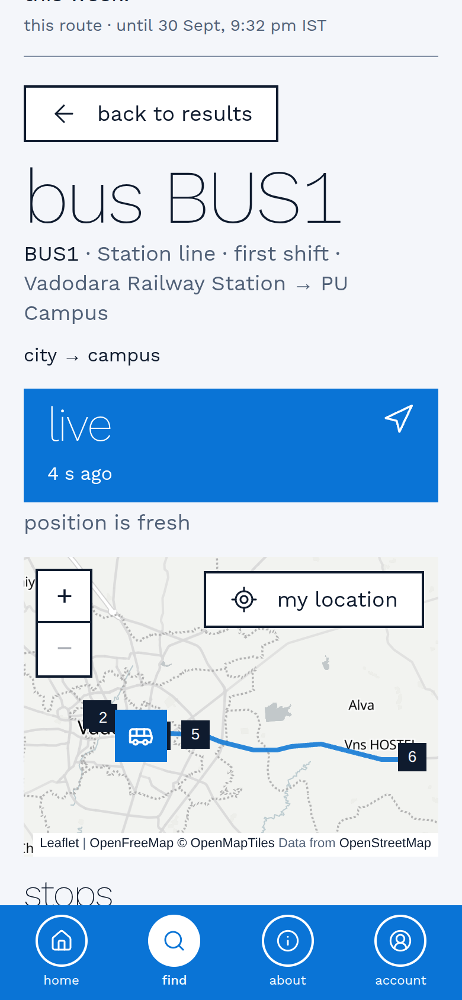
      <br><sub><b>Follow.</b> The live tile shows how old the last update is. "My location" is opt-in and never leaves the phone.</sub>
    </td>
  </tr>
</table>

### 4 · The office watches the fleet

<p align="center">
  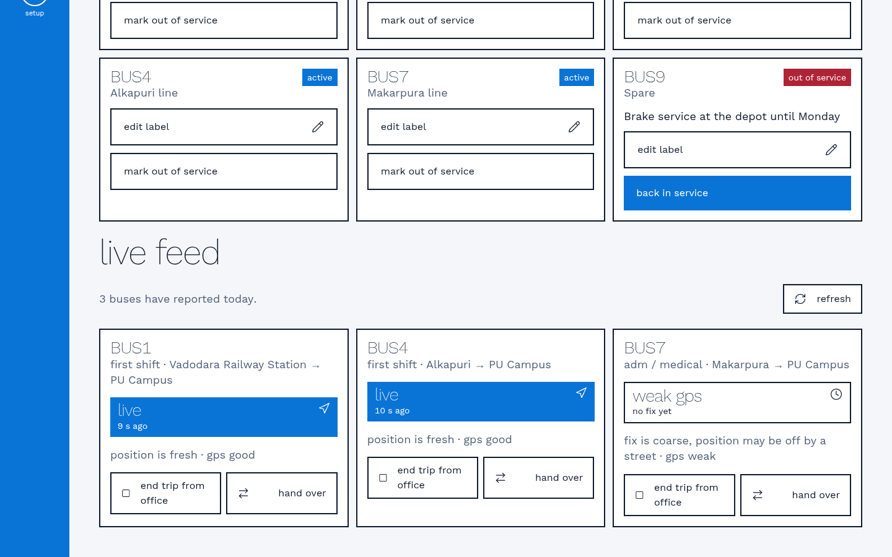
</p>

**Admin → Fleet.** The bus registry (active or out of service, with a reason) next to the live feed. Here BUS1 and BUS4 are live, BUS7 is reporting weak GPS and BUS9 is at the depot. Any running trip can be force-ended or handed over from this screen.

### 5 · People and records

<table>
  <tr>
    <td width="50%" valign="top">
      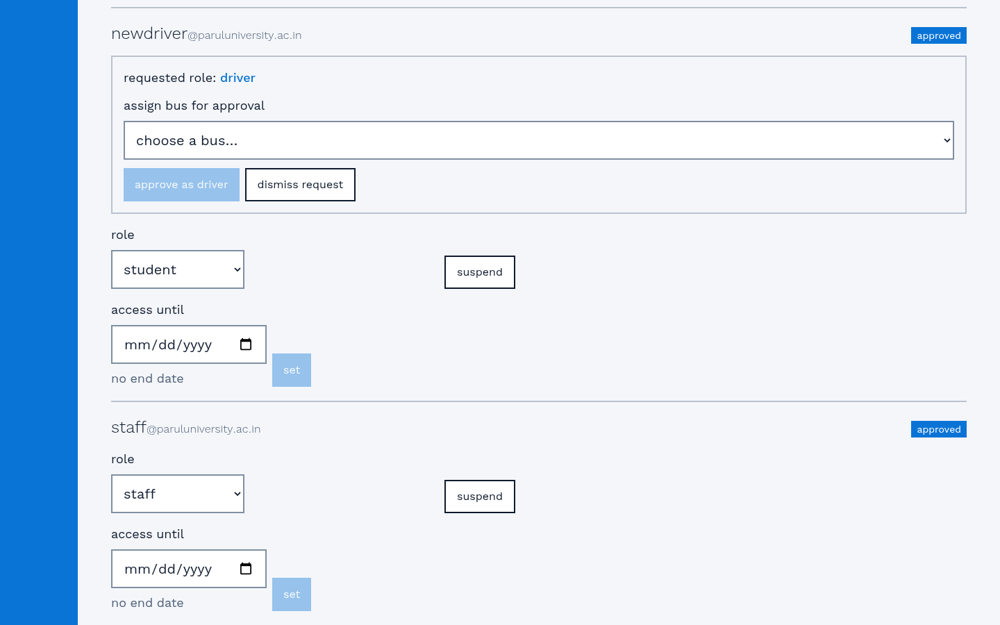
      <br><sub><b>Users.</b> Driver and admin requests wait for the office. A driver is approved together with a bus, or the request is dismissed.</sub>
    </td>
    <td width="50%" valign="top">
      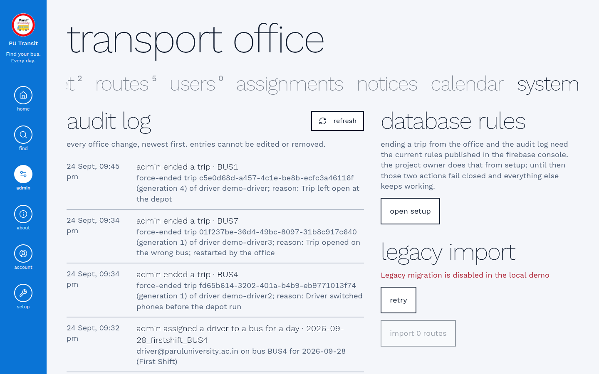
      <br><sub><b>System.</b> The append-only audit log: entries for force-ends, handovers, assignment changes and route publishes cannot be edited or removed.</sub>
    </td>
  </tr>
</table>

<details>
<summary><b>More screens</b>: home, sign-in, assignments, notices, calendar and the Hindi driver console</summary>
<br>

<table>
  <tr>
    <td width="50%" valign="top">
      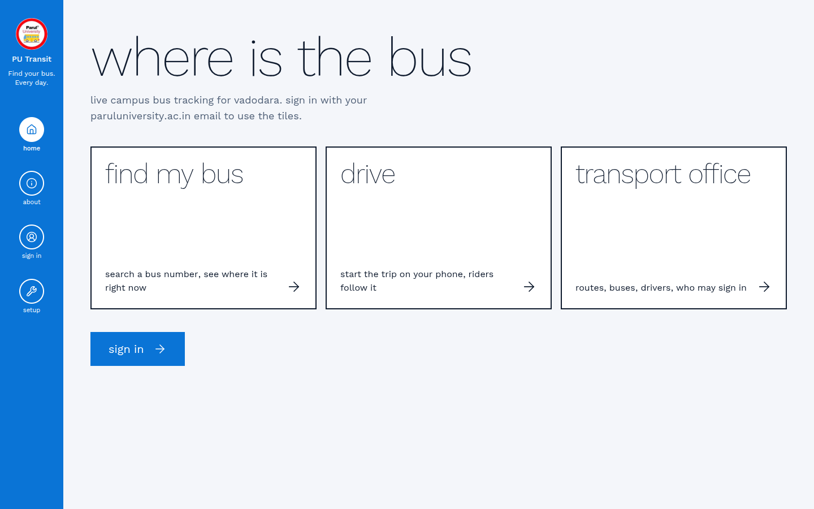
      <br><sub><b>Home.</b> One tile per job.</sub>
    </td>
    <td width="50%" valign="top">
      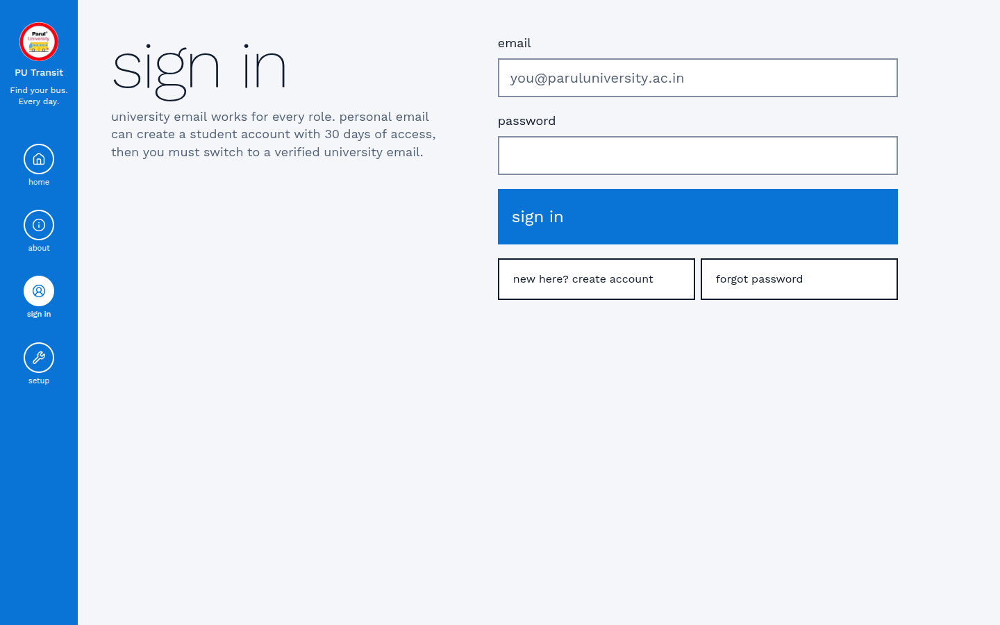
      <br><sub><b>Sign in.</b> A university email works for every role. A personal email can create a student account with 30 days of access.</sub>
    </td>
  </tr>
  <tr>
    <td width="50%" valign="top">
      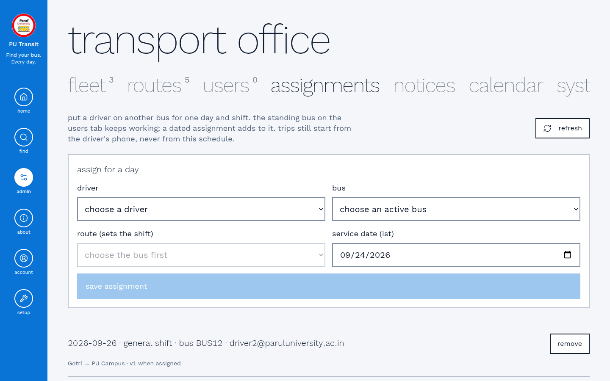
      <br><sub><b>Assignments.</b> Put a driver on another bus for one day and shift. The standing bus from the Users tab keeps working; the dated assignment adds to it.</sub>
    </td>
    <td width="50%" valign="top">
      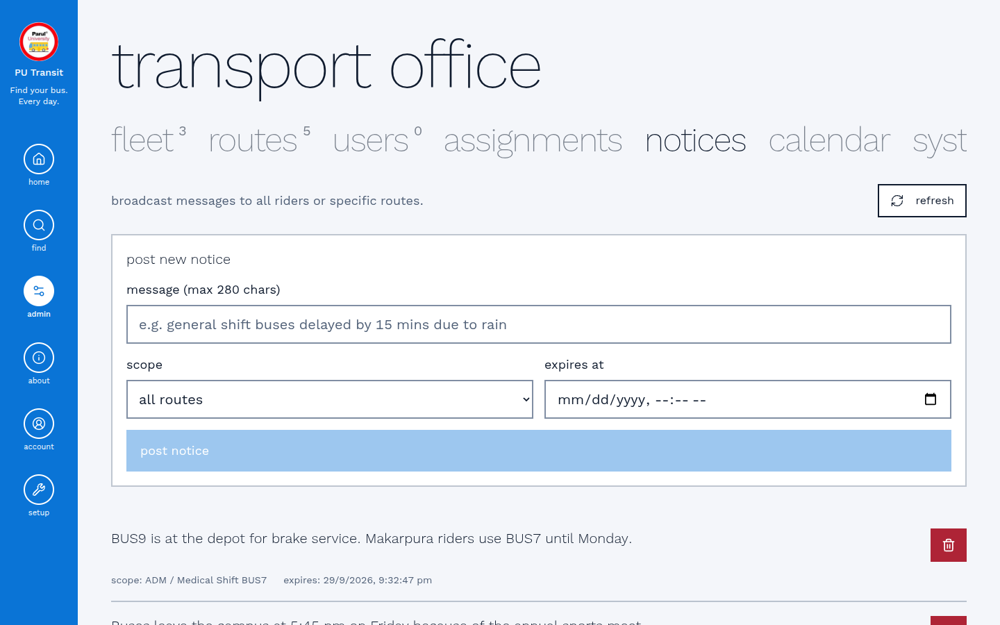
      <br><sub><b>Notices.</b> Up to 280 characters, for every route or one route, expiring within 30 days.</sub>
    </td>
  </tr>
  <tr>
    <td width="50%" valign="top">
      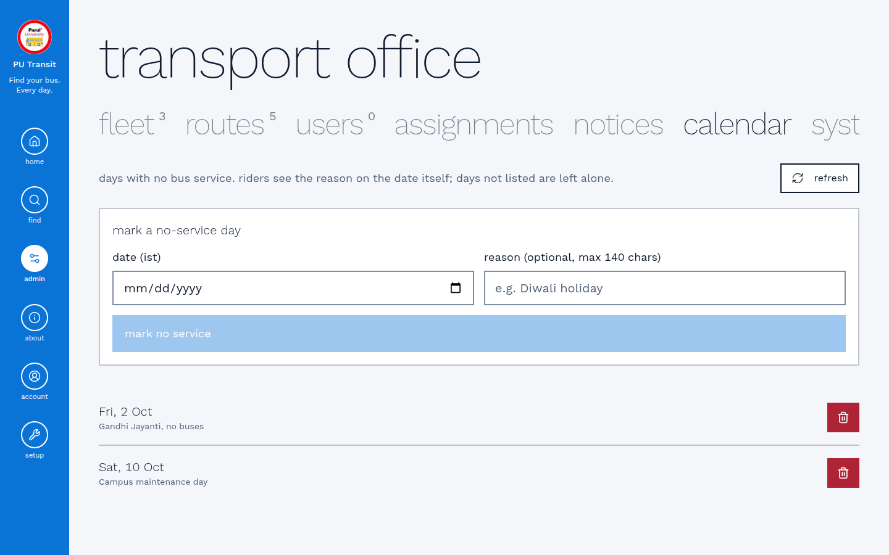
      <br><sub><b>Calendar.</b> No-service days with a reason. A date with no entry makes no claim either way.</sub>
    </td>
    <td width="50%" align="center" valign="top">
      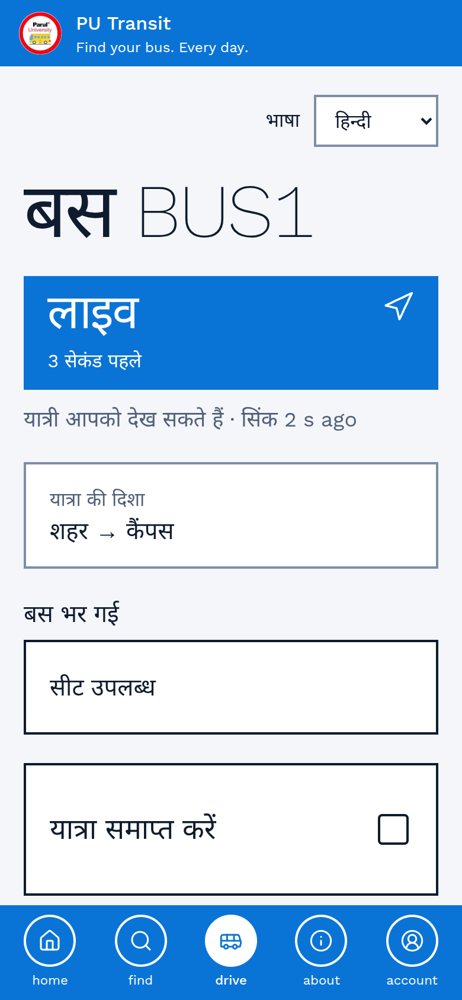
      <br><sub><b>हिन्दी.</b> The driver console in Hindi. Gujarati is in the same language menu.</sub>
    </td>
  </tr>
</table>

</details>

---

## System architecture

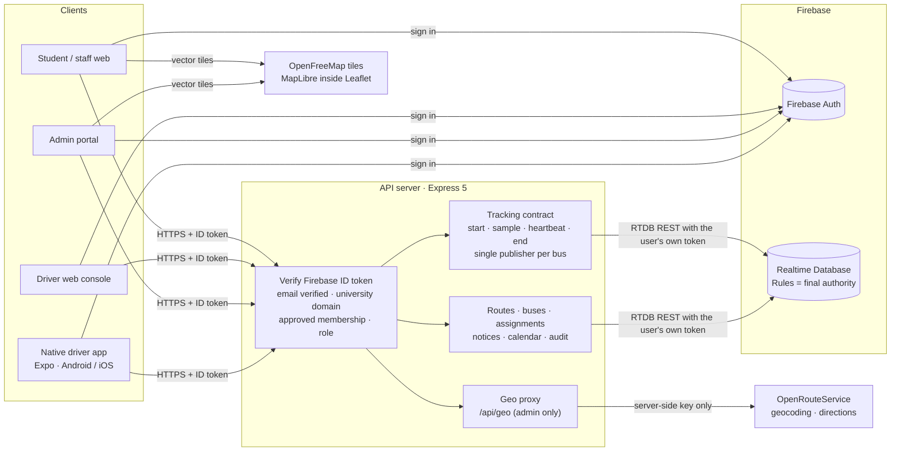
```mermaid
flowchart LR
    subgraph Clients
        S[Student / staff web]
        D[Driver web console]
        A[Admin portal]
        N[Native driver app<br/>Expo · Android / iOS]
    end

    subgraph API["API server · Express 5"]
        V[Verify Firebase ID token<br/>email verified · university domain<br/>approved membership · role]
        T[Tracking contract<br/>start · sample · heartbeat · end<br/>single publisher per bus]
        R[Routes · buses · assignments<br/>notices · calendar · audit]
        G["Geo proxy<br/>/api/geo (admin only)"]
    end

    subgraph Firebase
        AU[(Firebase Auth)]
        DB[(Realtime Database<br/>Rules = final authority)]
    end

    ORS[OpenRouteService<br/>geocoding · directions]
    OFM[OpenFreeMap tiles<br/>MapLibre inside Leaflet]

    S & D & A & N -- "sign in" --> AU
    S & D & A & N -- "HTTPS + ID token" --> V
    V --> T & R & G
    T & R -- "RTDB REST with the user's own token" --> DB
    G -- "server-side key only" --> ORS
    S & A -- "vector tiles" --> OFM
```

Key properties

- **Policy in three places, database last word.** RTDB Rules ([`firebase/database.rules.json`](firebase/database.rules.json), mirrored at [`artifacts/pu-transit/public/firebase-database.rules.json`](artifacts/pu-transit/public/firebase-database.rules.json)) decide every read and write. The API and UI re-check the same policy for better error messages, never to bypass it.
- **Admin verification, user-token data access.** The API verifies ID tokens with `firebase-admin`, then talks to RTDB **with the user's own token**. Normal app traffic never uses an admin bypass; only maintenance scripts (retention, migrations) use a service account.
- **One shared tracking state machine.** [`lib/driver-tracking`](lib/driver-tracking) is DOM-free and used by both the web driver console and the native app, so the data-integrity protocol (publisher session, sequence numbers, pending-end persistence, conflict handling) exists exactly once.
- **Typed API from one spec.** [`lib/api-spec`](lib/api-spec) holds the OpenAPI document; Orval generates the zod schemas ([`lib/api-zod`](lib/api-zod)) used by the server and the React Query client ([`lib/api-client-react`](lib/api-client-react)) used by both clients.
- **Map.** OpenFreeMap "Positron" vector style rendered by MapLibre GL inside Leaflet, with a raster OpenStreetMap fallback when WebGL is unavailable; `maxBounds` and a dynamic minimum zoom keep the map on Vadodara. In-app place suggestions and road plotting go only through the server-side ORS proxy; provider failures are shown, never replaced by synthesized paths. A route may instead be published with an acknowledged *manual path*, which riders see as "path not verified".
- **PostgreSQL** ([`lib/db`](lib/db), Drizzle) remains only for the one-time import of the legacy `routes` table; it is not the product database.

---

## How live tracking works

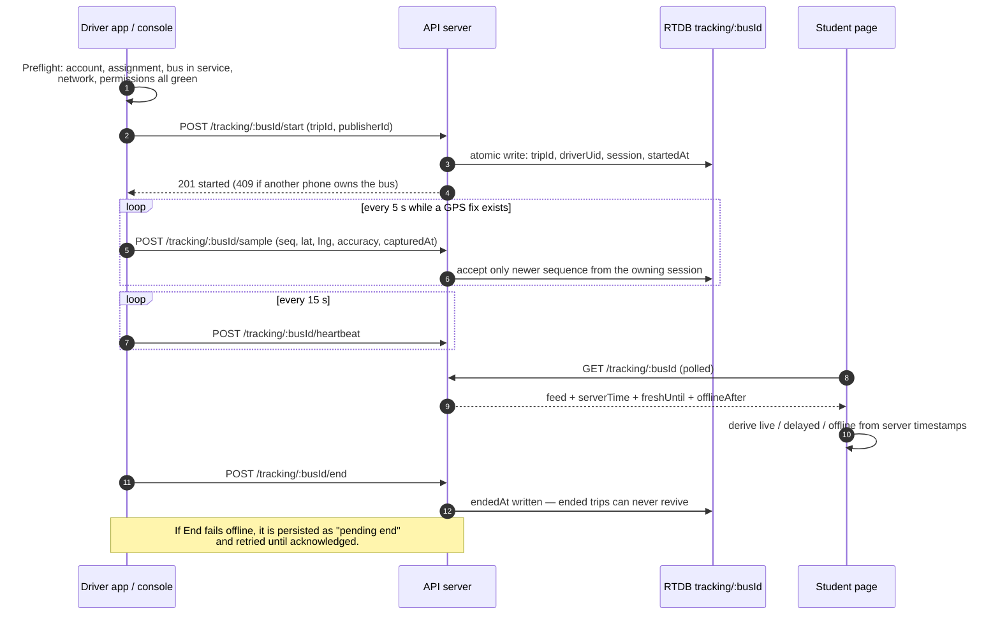
```mermaid
sequenceDiagram
    autonumber
    participant Dr as Driver app / console
    participant API as API server
    participant DB as RTDB tracking/:busId
    participant St as Student page

    Dr->>Dr: Preflight: account, assignment, bus in service,<br/>network, permissions all green
    Dr->>API: POST /tracking/:busId/start (tripId, publisherId)
    API->>DB: atomic write: tripId, driverUid, session, startedAt
    API-->>Dr: 201 started (409 if another phone owns the bus)
    loop every 5 s while a GPS fix exists
        Dr->>API: POST /tracking/:busId/sample (seq, lat, lng, accuracy, capturedAt)
        API->>DB: accept only newer sequence from the owning session
    end
    loop every 15 s
        Dr->>API: POST /tracking/:busId/heartbeat
    end
    St->>API: GET /tracking/:busId (polled)
    API-->>St: feed + serverTime + freshUntil + offlineAfter
    St->>St: derive live / delayed / offline from server timestamps
    Dr->>API: POST /tracking/:busId/end
    API->>DB: endedAt written — ended trips can never revive
    Note over Dr,API: If End fails offline, it is persisted as "pending end"<br/>and retried until acknowledged.
```

Driver-side phases (shared state machine):

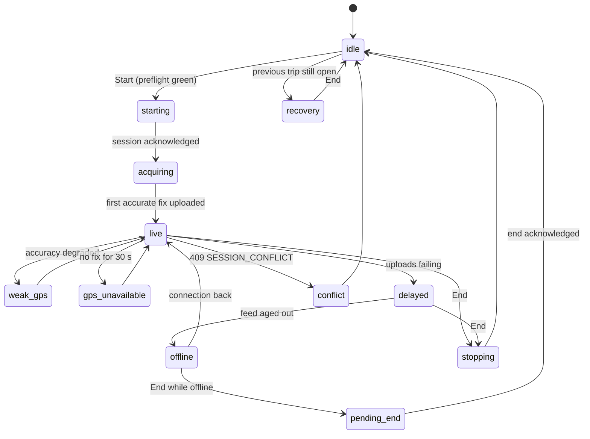
```mermaid
stateDiagram-v2
    [*] --> idle
    idle --> starting: Start (preflight green)
    starting --> acquiring: session acknowledged
    acquiring --> live: first accurate fix uploaded
    live --> weak_gps: accuracy degraded
    weak_gps --> live
    live --> gps_unavailable: no fix for 30 s
    gps_unavailable --> live
    live --> delayed: uploads failing
    delayed --> offline: feed aged out
    offline --> live: connection back
    live --> stopping: End
    delayed --> stopping: End
    offline --> pending_end: End while offline
    pending_end --> idle: end acknowledged
    stopping --> idle
    live --> conflict: 409 SESSION_CONFLICT
    conflict --> idle
    idle --> recovery: previous trip still open
    recovery --> idle: End
```

What riders see is derived on the client from **server** timestamps in the feed (`freshUntil`, `offlineAfter`), so a phone with a wrong clock cannot make a bus look live:

| Rider state | Meaning |
|---|---|
| `not_started` | No trip for this bus today |
| `acquiring` | Trip started, no accurate fix yet |
| `live` | Fresh, accurate position |
| `weak_gps` | Position shown as approximate |
| `delayed` | Last update older than the fresh window |
| `gps_unavailable` | Trip active but no usable fix |
| `offline` | Feed silent past the offline window |
| `ended` | Driver or office ended the trip |

Ownership rules enforced by the API and the Rules: one publisher per bus (`tripId` + `publisherId`), samples must carry a strictly increasing sequence, a superseded session receives `409 SESSION_CONFLICT` and drops to idle, an office **force-end** or **handover** ends the current trip and writes an audit row, and an ended trip cannot be revived.

---

## Route publishing lifecycle

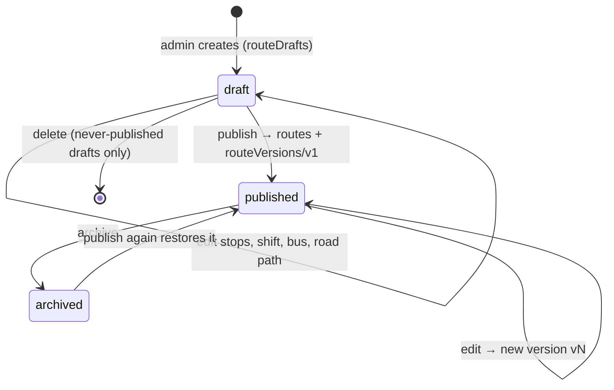
```mermaid
stateDiagram-v2
    [*] --> draft: admin creates (routeDrafts)
    draft --> draft: edit stops, shift, bus, road path
    draft --> published: publish → routes + routeVersions/v1
    published --> published: edit → new version vN
    published --> archived: archive
    archived --> published: publish again restores it
    draft --> [*]: delete (never-published drafts only)
```

- A route needs a shift, a bus from the registry, at least one stop and the start / end shown to riders; the builder names every missing field under itself.
- Road paths come from ORS directions bound to the exact stop list that was plotted; a stale response never attaches to an edited list. Adding, removing or reordering a stop clears the plotted path. Publishing needs either that ORS path or a ticked *manual path*, and riders see a manual path as "path not verified".
- Riders always read `routes/{id}` (the current published version); older versions are kept at `routeVersions/{id}/{n}` and served by `GET /routes/:id/versions/:n`.
- A running trip pins the route version it started with; new versions reach riders on the next trip, and moving a route to another bus is refused while that bus has a live trip.

---

## Data model

All product data is in RTDB under these top-level nodes ([`firebase/database.rules.json`](firebase/database.rules.json)):

| Node | Contents | Writers |
|---|---|---|
| `memberships/{uid}` | role (`student` · `staff` · `driver` · `admin`), status (`pending` · `approved` · `rejected` · `suspended`), email, requested role, `assignedBusId` (standing bus), `expiresAt`, timestamps | self-create at sign-up; admins |
| `buses/{busId}` | bus registry: label, status (`active` / `out_of_service`), reason | admins |
| `routes/{id}` | published route: shift, bus, kind (`bus` / `shuttle`), origin, destination, ordered stops, geometry, add-ons | admins via API |
| `routeDrafts/{id}` | unpublished drafts | admins via API |
| `routeVersions/{id}/{n}` | immutable published versions | API on publish |
| `assignments/{driverUid}/{id}` | dated assignments (the standing bus is `memberships/{uid}.assignedBusId`) | admins |
| `tracking/{busId}` | the single atomic trip node: `tripId`, `driverUid`, `publisherId`, last sample, accuracy, heartbeat, `endedAt` | driver via API; admin force-end / handover |
| `audit/{id}` | append-only office actions (force-end, handover, role changes, route publishes, …) | API |
| `notices/{id}` | office notices (≤ 280 chars, ≤ 30 days) | admins |
| `serviceCalendar/{date}` | no-service days; no entry means no claim | admins |
| `maintenance/*` | retention job bookkeeping | service account |

---

## Security and access model

- **Identity** — Firebase email/password with mandatory email verification. Access requires an eligible email **and** an approved, current membership. University staff and students use `@paruluniversity.ac.in`; a new student may use a personal email for 30 days from membership creation, then must switch to a verified university address from **Account**.
- **Roles** — student / staff are approved immediately; driver and admin requests are approved as student **plus a requested role** until the office confirms them in **Admin → Users**. The root admin account is protected and can also drive (still assignment-gated).
- **Revocation** — the web app has no RTDB listener; an API `403` is the revocation signal and refreshes `/auth/me` once. Membership expiry (`expiresAt`) is enforced in Rules and in every API gate.
- **Secrets** — the ORS key and the service account exist only on the server. The web bundle never contains a server secret; [`scripts/secrets-sweep.sh`](scripts/secrets-sweep.sh) scans the tree, the git history and both build outputs without ever printing a value (planted-control runs are recorded in `docs/evidence`).
- **Abuse limits** — per-user then per-client rate limits ([`docs/ops-notes.md`](docs/ops-notes.md)), per-path request body caps, key-safe ids validated by the OpenAPI `pattern`s.
- **Retention** — `retention:cleanup` ends trips silent for more than an hour and removes tracking data older than 90 days using a service-account identity, never the app path.
- **Privacy** — no rider location is uploaded; drivers publish only while a trip is running, and the audit trail records office actions, not movement history.

---

## API overview

All routes are served under `/api`. Every protected route requires `Authorization: Bearer <Firebase ID token>`; the gate level is shown in the last column.

| Method | Path | Purpose | Gate |
|---|---|---|---|
| GET | `/healthz` | liveness | public |
| GET | `/auth/me` | identity, membership, drivable buses, today's assignment | signed-in |
| GET | `/routes`, `/routes/:id/versions/:n` | published routes and versions | member |
| POST / PUT / PATCH / DELETE | `/routes`, `/routes/:id` | create, replace, edit, delete draft | admin |
| POST | `/routes/:id/archive` | archive (publishing again restores the route) | admin |
| GET | `/buses` · POST `/buses` · PATCH `/buses/:busId` | bus registry | member · admin |
| PATCH | `/memberships/:uid` | role, status, standing bus, expiry | admin |
| GET / POST / DELETE | `/assignments`, `/assignments/:driverUid/:assignmentId` | dated assignments | admin |
| GET | `/tracking/:busId` | rider feed with server timing | member |
| GET | `/tracking` | fleet feeds | admin |
| POST | `/tracking/:busId/start` · `/sample` · `/heartbeat` · `/end` | trip lifecycle (single owner, idempotent) | driver with assignment |
| POST | `/tracking/:busId/force-end` · `/handover` | office intervention with audit | admin |
| POST | `/geo/geocode` · `/geo/directions` | Vadodara-boxed place search and road paths via ORS | admin |
| GET · POST · DELETE | `/notices`, `/notices/:id` | notices | member · admin |
| GET · PUT · DELETE | `/service-calendar`, `/service-calendar/:date` | no-service days | member · admin |
| GET | `/audit` | append-only audit log | admin |

The full contract, including response schemas and error codes, is the OpenAPI document in [`lib/api-spec`](lib/api-spec).

---

## Repository structure

```
.
├── artifacts/
│   ├── pu-transit/                 Web app (React 19 + Vite 7 + Tailwind 4)
│   │   ├── src/pages/              home, account, student, driver, admin/{fleet,routes,users,assignments,notices,calendar,system}, setup, about
│   │   ├── src/components/         auth-gate, layout shell, map/{map-view,vector-basemap,place-search}, ui/*
│   │   ├── src/lib/                api client, status-aging, map-config, ors helpers, firebase, storage
│   │   ├── src/hooks/              use-transit (feeds + aging timers)
│   │   ├── public/                 firebase-database.rules.json (canonical Rules), logo.png, robots.txt
│   │   └── DESIGN.md · PRODUCT.md  Design system ("Metro typographic tiles") and product record
│   ├── api-server/                 Express 5 API
│   │   ├── src/routes/             transit (routes, auth/me, notices, calendar, audit), tracking, geo, buses, assignments, health
│   │   ├── src/lib/                firebase (token verify + RTDB REST), tracking transitions, assignments, buses, audit, ors, route-path
│   │   └── src/middleware/         firebase-auth (member / driver / admin gates), rate-limit
│   ├── pu-transit-driver/          Native driver app (Expo SDK 57, expo-location + expo-task-manager)
│   │   ├── app/index.tsx           single-screen driver console
│   │   ├── lib/                    preflight, build-step, account-steps, permissions, tracking adapter, evidence log
│   │   └── components/             purpose sheet before each OS prompt
│   └── mockup-sandbox/             Design-canvas preview server (tooling, not part of the product)
├── lib/
│   ├── driver-tracking/            Shared tracking state machine (web + native), DOM-free
│   ├── api-spec/                   OpenAPI document + Orval codegen
│   ├── api-zod/                    Generated zod schemas (server validation)
│   ├── api-client-react/           Generated React Query client (both clients)
│   └── db/                         Drizzle schema for the legacy PostgreSQL routes table
├── firebase/                       database.rules.json (mirror), firebase.json (emulators), firestore.rules (locked)
├── scripts/                        demo launcher + seed, Rules emulator tests, secrets sweep, retention job,
│                                   bus-registry migration, native evidence analysers (nat01 / nat05 / nat06)
├── docs/                           PRD, audit, tracking contract, Firebase setup, runbooks, dated evidence,
│                                   readme/ (the screenshots and banner used in this README)
├── .migration-backup/              Archived original static app (pre-rebuild), credentials removed
├── replit.md                       Working notes and decisions for collaborators
└── pnpm-workspace.yaml             pnpm workspace + dependency catalog
```

---

## Tech stack

| Layer | Choice |
|---|---|
| Web | React 19, TypeScript, Vite 7, Tailwind CSS 4, wouter, TanStack Query, Firebase JS SDK 12 |
| Map | Leaflet 1.9 + MapLibre GL 6 (OpenFreeMap Positron style), raster OpenStreetMap fallback |
| API | Node.js 24, Express 5, firebase-admin (token verification), zod (generated), pino-style structured logs |
| Native | Expo SDK 57, expo-location, expo-task-manager, expo-battery, AsyncStorage, React Query |
| Data | Firebase Authentication, Firebase Realtime Database with declarative Rules; PostgreSQL + Drizzle for the legacy import only |
| Geo | OpenRouteService (server-side proxy, Vadodara bounding box) |
| Tooling | pnpm 10 workspaces with TypeScript project references, Orval, Vitest, node:test, Firebase emulators |

---

## Getting started

### Prerequisites

- **Node.js 24** and **pnpm 10** (`npm install --global pnpm@10`)
- **Java 21+** for the Firebase Realtime Database emulator (local demo and Rules tests)
- Free ports **5173** (web), **3001** (API), **9099** (Auth emulator), **9000** (RTDB emulator)

### Install

```bash
pnpm install --frozen-lockfile
pnpm run typecheck:libs        # builds the shared libraries' type output
```

Use pnpm only; the root `preinstall` hook rejects npm and yarn. Generated API clients are checked in, so no codegen step is needed to run the project.

### Run the isolated local demo

```bash
pnpm demo
```

Then open **http://127.0.0.1:5173/**. The launcher starts the Firebase Auth + RTDB emulators under the non-cloud project `demo-pu-transit`, seeds synthetic accounts and data, and runs the web app and the API. No Firebase login, `.env` file, secret or Rules publication is required, and nothing touches a real project.

| Role | Sign-in email | Password | Try |
|---|---|---|---|
| Student | `student@paruluniversity.ac.in` | `DemoTransit123!` | `/student` — find BUS1, open its published route |
| Driver | `driver@paruluniversity.ac.in` | `DemoTransit123!` | `/driver` — BUS1 is the standing bus; allow location, Start, then End |
| Admin | `admin@paruluniversity.ac.in` | `DemoTransit123!` | `/admin` — Users, Fleet, Routes; edit a record and reload |

Press Ctrl+C to stop; nothing is persisted, so the next `pnpm demo` starts fresh. With the demo running, `pnpm demo:check` performs a repeatable integration pass (real emulator sign-ins for all three roles, cross-role denials, direct RTDB writes denied).

### Run against a real Firebase project

Follow [`docs/Firebase-Setup.md`](docs/Firebase-Setup.md): create the project, enable Email/Password sign-in, publish the Rules from the canonical file (an admin can also copy or download them from the in-app `/setup` page), then start the web and API with the variables in [Configuration](#configuration). The web app expects the API at same-origin `/api`.

### Build

```bash
pnpm --filter @workspace/api-server run build
PORT=5173 BASE_PATH=/ NODE_ENV=production pnpm --filter @workspace/pu-transit run build
```

Web output is `artifacts/pu-transit/dist/public`; API output is `artifacts/api-server/dist`.

---

## Configuration

The API reads process environment variables (no automatic `.env` loading). Operator-set variables only, names only — values are never committed; hosting platforms inject their own runtime variables in addition.

| Variable | Used by | Notes |
|---|---|---|
| `PORT` | web, API, native dev server | supplied by the runtime |
| `BASE_PATH` | web (Vite) | `/` for a root deployment |
| `FIREBASE_PROJECT_ID`, `FIREBASE_DATABASE_URL` | API | pinned to the production project; the demo uses `demo-pu-transit` |
| `FIREBASE_AUTH_EMULATOR_HOST`, `FIREBASE_DATABASE_EMULATOR_HOST` | API (demo only) | accepted only together with the demo opt-in flags |
| `PU_TRANSIT_DEMO`, `VITE_PU_TRANSIT_DEMO` | demo launcher | never set these on a real deployment |
| `UNIVERSITY_EMAIL_DOMAINS` | API | defaults to `paruluniversity.ac.in`; must agree with the Rules |
| `ORS_API_KEY` | API only | OpenRouteService key for `/api/geo/*`; never a `VITE_` variable |
| `FIREBASE_SERVICE_ACCOUNT_JSON` (or `FIREBASE_CLIENT_EMAIL` + `FIREBASE_PRIVATE_KEY`) | maintenance scripts only | retention job and Firebase inspection — not the app path |
| `PU_ADMIN_ID_TOKEN` | bus-registry migration script | short-lived admin ID token; never stored |
| `LOG_LEVEL` | API | pino level, default `info` |
| `GCLOUD_PROJECT` | demo launcher | set by `pnpm demo` for the emulators |
| `DATABASE_URL` | legacy import endpoint only | PostgreSQL for the one-time routes import |
| `EXPO_PUBLIC_DOMAIN` | native app | host that serves `/api` for the driver app |

---

## Testing

```bash
pnpm run typecheck                                        # every package
pnpm --filter @workspace/pu-transit run test              # web: Vitest (pages, map helpers, state aging, route builder)
pnpm --filter @workspace/api-server run test              # API: Vitest (trip transitions, gates, bounds, rate limits)
pnpm --filter @workspace/pu-transit-driver run test       # native: node:test (preflight steps, build step, account rules)
pnpm --filter @workspace/scripts run firebase:rules:test  # RTDB Rules against the emulator (Java 21+)
pnpm --filter @workspace/scripts run secrets:sweep        # tree + history + build outputs (build both first)
```

What the suites protect

- **Tracking contract** — start / sample / heartbeat / end, single owner, idempotent retries, sequence ordering, ended trips never revive, force-end and handover audit rows.
- **Access** — email verification, university domain and grace period, membership status and expiry, role gates, owner-as-driver, revocation via `403`.
- **Routes** — draft validation, publish / version / archive transitions, stale directions responses discarded, ORS inputs bounded to Vadodara.
- **Rider states** — live / delayed / offline windows computed from server time.
- **Native preflight** — every row that locks Start carries one actionable fix line; Expo Go and the browser are reported as unusable builds.
- **Rules** — every node's read / write policy, including the Rules-side mirrors of API limits (string lengths, value domains, 24 h assignment grace).

Dated results and rehearsal logs are indexed in [`docs/evidence/README.md`](docs/evidence/README.md).

---

## Native driver app

The web driver console tracks only while the browser tab is in the foreground. Background tracking (screen off, app minimised) needs the native app in [`artifacts/pu-transit-driver`](artifacts/pu-transit-driver):

- Same tracking contract and state machine as the web (imports [`lib/driver-tracking`](lib/driver-tracking)); platform adapters provide the GPS watcher (`expo-location` foreground service + `expo-task-manager`), key-value persistence and transport.
- A **purpose sheet** precedes every OS permission prompt; the preflight lists app build, account, assignment, bus, network, location services, foreground and background location, battery optimisation and notifications — each red row carries one instruction, and Start re-runs the whole list at tap time.
- An on-device **evidence log** (export from the app) is analysed by `nat01:coverage` (minute coverage of a road run), `nat05:parity` (ownership invariants) and `nat06:auth` (negative auth cases).

**Expo Go is a preview only.** The OS does not let Expo Go run a background location service, so the app reports "App build: Expo Go" and keeps Start locked there. A real trip needs an installed build:

| Platform | Build path |
|---|---|
| Android | `cd artifacts/pu-transit-driver && EXPO_PUBLIC_DOMAIN=<api host> pnpm exec expo run:android --device --variant release` on a computer with Android Studio |
| iOS | Store / TestFlight build through the hosting platform's publish flow (Apple Developer account required) |

Details and the run protocol: [`docs/evidence/rehearsal-log-nat01.md`](docs/evidence/rehearsal-log-nat01.md).

---

## Deployment

- The web app is served at `/` and the API at `/api` on the same origin; the web bundle only ever calls same-origin `/api`. The API currently registers permissive `cors()`; tightening it to the deployed origin is an open hardening item.
- Firebase Rules are **published by the project owner** from the Firebase console (or copied from the in-app `/setup` page). A code change to the Rules file changes nothing until it is published; an API path that is authorised but hits unpublished Rules answers `503` with code `rules`.
- Server secrets (`ORS_API_KEY`, service account) are configured on the host, never in the tree. The original static app (2026, before the rebuild) shipped a browser-side ORS key; it was removed from the tree on 13 Sep 2026 but still exists in Git history, so that key must be treated as public and rotated by the owner at OpenRouteService.
- The retention job (`pnpm --filter @workspace/scripts run retention:cleanup`) is meant to run on a schedule with the service-account identity.
- Rate limits, request bounds and incident notes: [`docs/ops-notes.md`](docs/ops-notes.md).

---

## Documentation index

| Document | Purpose |
|---|---|
| [`docs/PU-Transit-PRD.md`](docs/PU-Transit-PRD.md) | Product requirements v1.1 |
| [`docs/PU-Transit-PRD-Remaining.md`](docs/PU-Transit-PRD-Remaining.md) | Remaining-work PRD v2.0 — workstreams, decisions register, open acceptance scenarios |
| [`docs/PU-Transit-Final-Report.md`](docs/PU-Transit-Final-Report.md) | Project report: problem, architecture, security, evidence, limitations, future work |
| [`docs/PU-Transit-Demo-Script.md`](docs/PU-Transit-Demo-Script.md) | Recording script for a live / delayed / offline demonstration |
| [`docs/Delivery-Status.md`](docs/Delivery-Status.md) | Requirement-by-requirement delivery status, decisions log and grading notes |
| [`docs/Phase-2-Reliable-Tracking.md`](docs/Phase-2-Reliable-Tracking.md) | The tracking contract: model, API, client controller |
| [`docs/route-publishing.md`](docs/route-publishing.md) | Route drafts, versions and archive |
| [`docs/assignments.md`](docs/assignments.md) · [`docs/buses-registry.md`](docs/buses-registry.md) | Assignments and bus-registry runbooks |
| [`docs/Firebase-Setup.md`](docs/Firebase-Setup.md) | Firebase project, Rules publication and bootstrap |
| [`docs/permission-review-nat02.md`](docs/permission-review-nat02.md) | On-device permission flow review checklist |
| [`docs/ops-notes.md`](docs/ops-notes.md) | Rate limits, request bounds, operational notes |
| [`docs/PU-Transit-Audit.md`](docs/PU-Transit-Audit.md) | Audit of the original application before the rebuild |
| [`docs/evidence/README.md`](docs/evidence/README.md) | Index of dated test results, publication records and rehearsal logs |
| [`artifacts/pu-transit/DESIGN.md`](artifacts/pu-transit/DESIGN.md) | Design system: PU blue `#0A76D6`, Metro typographic tiles, accessibility rules |
| [`replit.md`](replit.md) | Working notes, gotchas and architecture decisions for collaborators |

---

## Project status

The web app, API and Rules are built and covered by automated tests; the native driver app is a feasibility build whose background-tracking behaviour has not yet been rehearsed on a device. Items that still depend on the operator — publishing the latest Rules payload, rotating the historical ORS key, restricting CORS, the live driver rehearsal, the native device run — are tracked with dates in [`docs/Delivery-Status.md`](docs/Delivery-Status.md) and [`docs/evidence/README.md`](docs/evidence/README.md), never implied by this README.

---

## Acknowledgements

- Map data © [OpenStreetMap](https://www.openstreetmap.org/copyright) contributors; vector tiles by [OpenFreeMap](https://openfreemap.org); rendering by [MapLibre GL](https://maplibre.org) and [Leaflet](https://leafletjs.com).
- Geocoding and directions by [OpenRouteService](https://openrouteservice.org).
- Built for the transport office, drivers, students and staff of Parul University, Vadodara.
